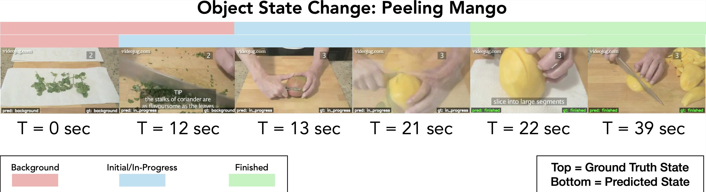

# Online Frame-Wise Object State Change Detection using Latent Recurrent Representations



[cropped clips](https://drive.google.com/drive/folders/1ujTZVVF3wu4D-EVI4HizOYifXGznEsB5?usp=drive_link)

dataloader usage:
```python
    # path_to_cropped_clips_dir: subdirectory name under HowToChange
    dataloader = HowToChangeDataLoader(path_to_cropped_clips_dir, split='train', test_mode=False)

    for data in dataloader:
        data["frames"] #Tensor(T, C, H, W), video frames in 224*224 resolution
        data["labels"] #Tensor(T), labels[i] == 1 if frames[i] is in end_state
        data["fps"]    #float
        data["osc"]    #str,  ocs in format verb_noun
        data["verb"]   #str
        data["noun"]   #str
```

Ideas for model implementation/training
- running a model directly from raw video frames sounds strange to me... maybe only run model every x frames and extract features from the past x frames using videoMAE https://huggingface.co/docs/transformers/en/model_doc/videomae#transformers.VideoMAEModel then use extracted features as model input
- remember text is also an input, need to choose a text encoder as well. 
- (future extension) we could improve the model with some differentiable text input. for example, for a state change *melting butter*, ask the LLM ahead of time "what does *melting butter* looks like when it's not completed or in progress" and "what does *melting butter* looks like when it's done". LLM might generate something like "the butter looks solid" for when it's in progress, and "butter is completely liquid and sizzling" for when it's done. Save those descriptions in a bank ahead of time. Then during training/inference, our model decides which of those descriptions the visual features are closer to. 

Dataset considertaions (no need to fix):
- there is class imbalance (a lot more 0s than 1s), which may make the model prone to predicting 0 (?)
- there are also irrelevant frames.


results

| Method                    | Acc. (%) ↑ | End-state F1 (%) ↑ | End-state IoU (%) ↑ | Onset error (s) ↓ |
|---------------------------|-----------:|-------------------:|--------------------:|------------------:|
| VidOSC (multitask)       |      38.07 |               1.37 |                1.64 |             10.73 |
| VidOSC (single task)     |      53.15 |              31.51 |               36.91 |             10.60 |
| —                         |           |                   |                    |                  |
| Ours                     |      49.50 |              31.25 |               36.92 |              8.18 |
| Ours (+ LLM description) |        –   |                 –  |                  –  |                –  |


